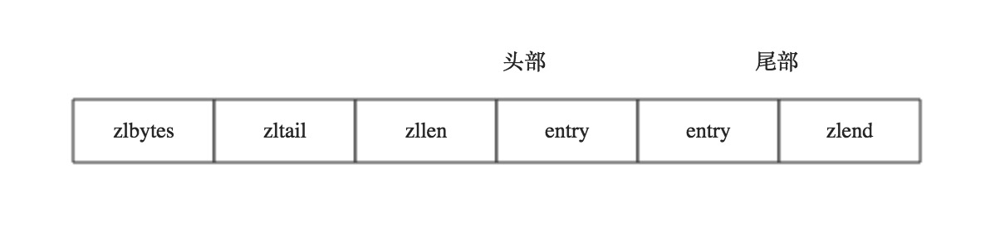

# 链表


redis 链表使用的是双向无环链表。listNode 结构如下

```
typedef struct listNode {
  // 前置节点
  struct listNode *prev;
  
  // 后置节点
  struct listNode *next;
  
  // 节点的值
  void *value

} listNode
```


同时，为了方便操作，redis 提供了一个 list 结构来持有链表

```
typedef struct list {
   
   // 表头信息
   listNode *head;
   
   // 表尾信息
   listNode *tail;
   
   // 链表所包含的节点数量
   unsigned long len;
   
   //节点值复制函数
   void *(*dup)(void *ptr);
   
   //节点值释放函数
   void *(*free)(void *ptr);
   
   //节点值对比函数
   int (*match)(void *ptr,void *key);
   
}

```


# 压缩列表

redis 自己实现的一种数据结构，使用连续的内存空间，已达到节省内存的目的。

压缩列表并不是对数据利用某种算法进行压缩，而是将数据按照一定规则编码在一块连续的内存区域，目的是节省内存。

当列表|有序集合|哈希量少，或者键值都是比较短的字符串，redis 会使用压缩列表保存数据


## 数据结构




* zlbytes：无符号整数，固定 4 个字节，储存压缩列表长度
* zltail：无符号整数，固定 4 个字节，代表指向列表尾部的偏移量
* zllen：压缩列表节点个数，固定 2 个字节，当个数大于 2^16 - 1 个时，次数无效，需要遍历来计算个数
* entryN：列表节点区域
* zlend：列表结束，1 个字节长，固定值 255


### 压缩列表节点的结构

  
* previous length : 储存上一个节点的长度，因此压缩列表可以从尾部向头部遍历，当前节点位置减去上一个节点长度，就得到上个节点的起始位置，长度为 1 个 或者 5 个字节
* encoding 属性记录了节点 content 属性的类型和长度
   1. 一个字节、两个字节、五个字节长，最高位为 00 、01 、10 表示content保存着字节数组，数组长度由最高两位之后的其他位记录
   2. 一个字节，以 11 开头，表示 content 属性保存着整数值。整数的类型和长度由后 6 位表示

* content ：存储内容


## 连锁更新

每个节点的 previous_entry_length 属性都记录了前一个节点的长度，内存大小为 1 或 5 个字节，当修改节点内容时，可能导致下一位的 previous_entry_length 位数改变，导致出现连锁更新问题


例如：
1. e1 ~ en 的长度都介于 250 到 253 ，现在在表头插入一个新的节点，长度大于 254
2. 此时 e1 的 previous_entry_length 不够用了，改为 5 个字节，程序将对压缩列表执行空间重新分配操作，
3. 现在 e1 也大于 254 了，导致 e2 也需要重新分配一次类推


redis 将这种在特定情况下产生的连续多次空间扩展操作称为 连锁更新


所以在以压缩列表保存 redis 数据时，在进行更新操作时，有可能引发连锁更新，导致性能变差

##参考

https://juejin.im/post/6844903880489173000  
https://my.oschina.net/andylucc/blog/715325   
https://www.geek-share.com/detail/2776049000.html


